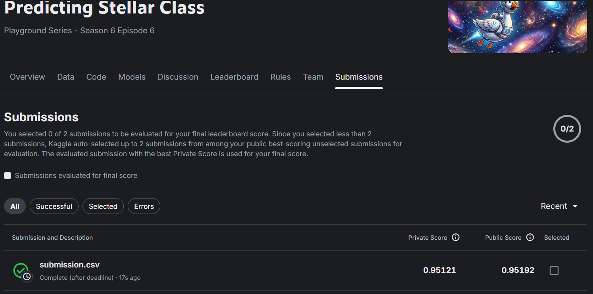

# Stellar Object Classification (Star / Galaxy / Quasar)

This project builds a machine learning model that classifies astronomical objects into
**Star**, **Galaxy**, or **QSO (Quasar)** based on photometric and spectral measurements.
The dataset is from the Kaggle Playground Series competition **S6E6**.

---

## 1. Workflow Summary

The overall workflow followed was:

1. Loaded and explored it (shape, data types, missing values, duplicates)
2. Visualize the class distribution and the spread of each numerical feature
3. Preprocess and engineer features so the data is model-ready
4. Split the data into train/test sets and done Stratified K-Fold Cross-Validation.
5. Train and tune multiple classification models
6. Compared all models on several metrics and picked the best one
7. Explained the best model's predictions using SHAP
8. Generated predictions on the Kaggle test set and created a submission file
9. Save the final model and use it inside a simple web interface for live predictions

## 2. Data Preprocessing

- **Missing values & duplicates:** Checked with `df.isnull().sum()` and
  `df.duplicated().sum()` — the dataset was clean, so no need to do anythng.
- **Outlier check:** Boxplots were plotted for all numerical columns and as we use tree based models no need to make changes in outlier .
- **Correlation check:** A correlation heatmap was plotted for the numerical features to see which feature correlate with which feature most.
- **Categorical encoding:**
  - `spectral_type` and `galaxy_population` were one-hot encoded using `pd.get_dummies()`(with `drop_first=True` to avoid redundant columns).
  - The target column `class` was label-encoded into numbers (`0, 1, 2`) using `LabelEncoder`, and the encoder was saved (`label_encoder.pkl`) so predictions can later be converted back to readable class names.
- **Train/test split:** An 80/20 split was used with 'stratify=y' to make sure all three classes are represented in the same proportion in both the train and test sets (as the classes are imbalanced).

## 3. Feature Engineering

- The **one-hot encoding** in the categorical columns (`spectral_type`, `galaxy_population`) into numeric columns models could use them.
- The `id` column was dropped as it carries no predictive information.

## 4. Model Training & Hyperparameter Tuning

As the dataset is large, hyperparameter tuning was first done on a **50,000-row sample** of the training data (as it was taking too much time), and then the best parameters were used to train the final version of each model on the **full training dataset**.

**Tuning method:** `RandomizedSearchCV` with `StratifiedKFold`, optimizing for**balanced accuracy** (a good metric here as classes were imbalaced).

Models trained and tuned:

 Model - Key hyperparameters tuned 

 Decision Tree - criterion, max_depth, min_samples_split, min_samples_leaf 
 Random Forest - n_estimators, criterion, max_depth, min_samples_split, min_samples_leaf 
 AdaBoost - n_estimators, learning_rate 
 Gradient Boosting - n_estimators, learning_rate, max_depth 
 XGBoost - n_estimators, learning_rate, max_depth 
 Stacking Ensemble - Random Forest + Gradient Boosting + XGBoost as base learners, Logistic Regression as the final estimator 

A Decision Tree was also visualized (`plot_tree` and `dtreeviz`) to visualize and see how the very first splits are being made.

## 5. Model Evaluation

Every model was evaluated on the held-out 20% test set using:

- Accuracy
- Balanced Accuracy (main metric, since classes are imbalanced)
- Precision, Recall, F1-score (weighted average)
-  classification report

All results were collected into one comparison table side by side. **XGBoost gave the best balanced accuracy** among all individual models and was selected as the **final model** used for SHAP analysis and the Kaggle submission.

All metrics for all the models sorted by Balanced Accuracy and rest of the mertics are so howned as per model

              Model  Accuracy  Balanced Accuracy  Precision    Recall  \ 
4            XGBoost  0.964917           0.951953   0.964902  0.964917   
3  Gradient Boosting  0.961280           0.945598   0.961230  0.961280   
5  Stacking Ensemble  0.959617           0.942218   0.959429  0.959617   
0      Decision Tree  0.949736           0.926736   0.949368  0.949736   
1      Random Forest  0.948904           0.925666   0.948623  0.948904   
2           AdaBoost  0.918204           0.893582   0.919543  0.918204   

 F1 Score  
4  0.964909  
3  0.961247  
5  0.959502  
0  0.949500  
1  0.948739  
2  0.918731 

## 6. SHAP Analysis (Model Explainability)

To understand *why* the final XGBoost model makes its predictions, SHAP(`shap.TreeExplainer`) was applied to a 500-row sample of the test set:

- **Bar plot** – shows which features matter most on average for predicting a class.
- **Beeswarm plot** – shows both feature importance and the direction of the effect (whether a high or low value pushes the prediction up or down).
- **Scatter plots** (`redshift`, `u`) – show how a single feature's value relates to its impact on the prediction.
- **Waterfall plots** – break down individual predictions row-by-row, showing exactly how each feature pushed that one prediction toward or away from a class.

**Key takeaway:** `redshift` was found to be one of the strongest and most consistent drivers of the classification decision, which matches the actual astrophysics — redshift is a well-known indicator of how far/what type of object we're looking at (quasars typically have much higher redshift than stars or nearby galaxies). The photometric bands (`u`, `g`,`r`, `i`, `z`) also contributed meaningfully, since different object types have distinct color/brightness signatures.

## 7. Final Model & Kaggle Submission

- The final chosen model was **XGBoost**, trained on the full training set with the best parameters found by `RandomizedSearchCV`.
- Predictions were generated on the official Kaggle `test.csv`, decoded back to class labels using the saved `LabelEncoder`, and written to `submission.csv`.
- The trained model (`best_model.pkl`) and label encoder (`label_encoder.pkl`) were saved using `joblib` so they could be reused inside the web application without retraining.

**Kaggle Score:** `[.95121]`

## 8. Web Application

A simple web inteface was built on top of the saved model (`best_model.pkl`) and label encoder (`label_encoder.pkl`). The app takes in the object's measurements (`u, g, r, i, z,alpha, delta, redshift, spectral_type, galaxy_population`) as input and returns the predicted class (`STAR`, `GALAXY`, or `QSO`) in real time.
**Demo Video (Google Drive link):** `[https://drive.google.com/file/d/1g4fQillZbN2GDOnNDseqKfzZlgc65oJI/view?usp=drivesdk]`

## 9. Conclusion & Learnings

- Tree-based ensemble models (especially **XGBoost**) handled this tabular astronomical dataset very well.
- Using a smaller sample for hyperparameter search and then training the final model on the full data was an effective way to save time without sacrificing much performance.
- **Balanced accuracy** was a better metric than only accuracy as there werethree classes are not equally represented.
- SHAP analysis confirmed that the model's decisions align with real astrophysical reasoning (redshift and photometric bands are genuinely meaningful for classifying stars, galaxies, and qso), which gives more confidence in the model beyond just its accuracy score.
- Saving the trained model and encoder made it possible to deploy the same model into a web inteface for interactive, real-time predictions.

**Notebook Link :** https://colab.research.google.com/drive/1K8kwFIu0uvnMJl819V4F-3heTfG9Ob40?usp=sharing

